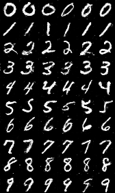
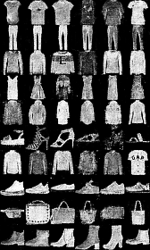

# DeliCGAN

使用DeliGAN和CGAN在小样本条件下生成样本，扩展样本集

## Requirment

* Tensorflow > 1.0
* Keras
* scipy == 1.2.1

## Result

分别从原始数据集中每个类别中取50个样本进行训练

在MNIST数据集和Fashion-MNIST数据集下测试

#### Mnist

#### Fashion-mnist

# Usage

工作目录在根目录下

## Training DeliCGAN

训练生成器模型：

    $ python Deli-Conditional-GAN/main.py --op 0

## Testing Classifier

测试样本扩展后的分类器效果

首先生成样本

    $ python Deli-Conditional-GAN/main.py --op 3 --generate_number 500 --generate_path generate-images/mnist

使用生成的样本训练分类器

DNN：

    $ python Classifier/mnist_mlp/mnist_mlp.py

CNN：

    $ python Classifier/mnist_cnn/mnist_cnn.py